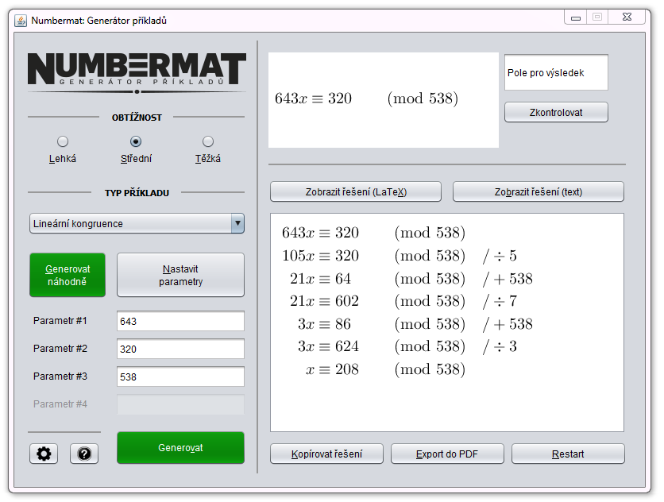

# Numbermat

Math problem generator created as a part of my [bachelor's thesis](https://is.muni.cz/th/k5kl2/)
at the [Faculty of Informatics](http://fi.muni.cz/), Masaryk University, Czech Republic.

Controlled via a GUI, Numbermat can generate from 13 types of math problems
(from the area of algebra and number theory), randomly or with user defined parameters.
It provides a solution for each problem and allows exporting it into `.tex` and a corresponding `.pdf` file.

The application is written in Java and requires a [Java Runtime Environment](https://www.java.com/en/download/) to run.

Therefore, it is preferred to use modern [web version](https://www.fi.muni.cz/~xzak11/) created by
Mário Žák in his [bachelor's thesis](https://is.muni.cz/th/zol1p/) in 2020. ([GitHub](https://github.com/maarioz/Numbermat-WebApp))

## License

[GNU General Public License version 3](http://www.gnu.org/licenses/gpl-3.0.html)

## Author

[Valdemar Švábenský](https://www.fi.muni.cz/~xsvabens/), 2014
